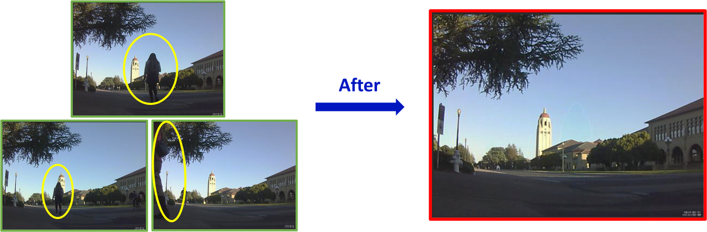
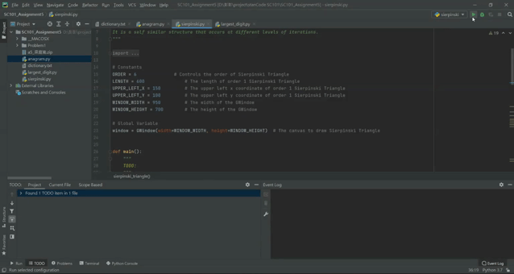
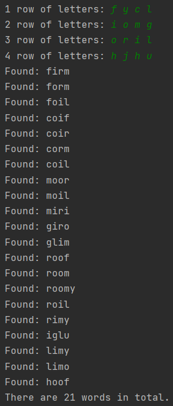

# stanCode SC101 project

This repository shows my programming projects done during the period of stanCode SC101 course.
(more about [stanCode](https://stancode.tw/))

- These small projects strengthen my understanding of the Python language.

- I also learned some fundamental knowledge about coding like object orientation, \
game production, data structures, data processing, recursion, and some search algorithms.

## Projects
### Breakout game
 - This is a simple breakout game built by campy packages.
  - Learning the concepts of object-orientation and classes in Python.
 - Please run my_breakout.py to start the game.

### Image processing
 - This is a program that can erase unexpected people on the image by choosing the best pixel between several images in the same sizes.
 - Please use terminal to execute this program and use the directory of images name as params.(os = window) ex. py myPhotoshop.py hoover
 

### Babynames
 - This is a simple full-stack project where users can type any English name to show how popular this name is from the 1900s to the 2010s.
 - Please run babynames.py to start this program.

### sierpinski triangle
 - This is a program that can draw the Sierpinski triangle by the concept of recursion in Python.
 - Please run sierpinski.py to start the project.

### Boggle game solver
 - This is a program that can quickly find all possible words on any boggle board. (Practicing the concept of Backtracking Algorithms)
 - Please run boggle.py,then type 4 rows of 4 English letters separated by spaces.
